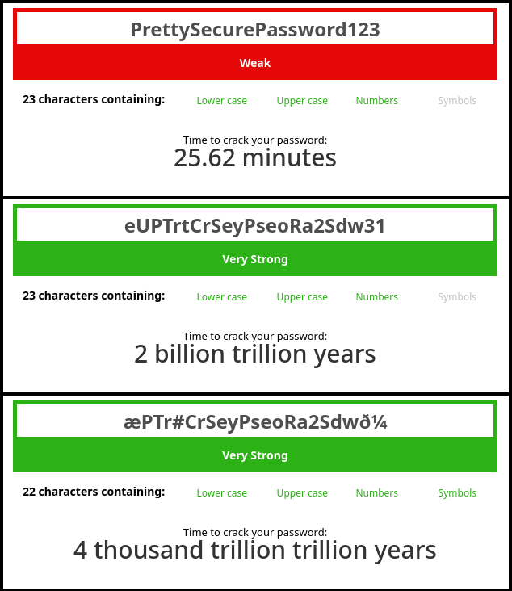

+++
title = 'Got Hacked? What to do next'
date = 2026-05-09T02:00:00-05:00 
draft = false
website = "a"

description = "asd"

tags = ["CyberSec4Normies", "CyberSec"]
+++

I’m writing this quick continence guide on “What to do while and after getting hacked” as a really close friend of mine got most of their accounts compromised, and I’ve been helping through since almost day-zero of the incident. By the time I’m writing, we are attempting to recover a Minecraft account – which by the way, showed to us that Microslop support is really stubborn.

Getting your accounts compromised or stolen is pretty common, and you shouldn’t be ashamed of seeking help, no one’s gonna judge you, unless you are in the wrong place, but guess what, you are not.

---
## Disable and lock your accounts

* If you have bank accounts linked with your compromised accounts, call your bank, or make use of the tools they provide and suspend your account temporarily until the threat is gone. However, if you are certain that the hackers got your card credentials (or just want to be safe), I’d suggest making a new bank account.  
* If your Steam account is compromised, contact Steam Support, explain your case, provide proofs and they will do the work. They are a best example of support that comes to my mind. Just give them 2 to 4 days and your account will be back, and I’m talking from experience.
* If your Microsoft account got compromised, and it’s worth recovering, you should pay a visit to the [Microsoft account recovery help]([https://discord.gg/uYRTAEhheP](https://discord.gg/uYRTAEhheP)) discord server, they explain thoroughly the process in #documentation and the helpers can guide you through the processes. If you come from there, the next sections may help you ^^
	*  Microsoft does not care about you, and the only way of getting what you want is being annoying. 
* If your Roblox (or any game) account got hacked, contacting support is the best way to go, i think. I haven't witnessed those processes.
Generally speaking, what you wanna do is make attackers and/or people that bought your account unable to use it.
## What do I do with my computer

> Before resetting your computer, make sure to log your device ID and other "volatile" identifiers that may help you recovering your accounts, back up your important files, bookmarks and sensitive information.

In my opinion, hunting down the Trojan can be time consuming, and in most of the cases, assuming you are not to deep in the rabbit hole of CyberSec, your attempts might be unfruitful.  On the other hand, [nuking your computer](https://www.howtogeek.com/202590/stop-trying-to-clean-your-infected-computer-just-nuke-it-and-reinstall-windows/) (reinstalling its OS) is the safest bet, as nothing will probably survive to that. 

I'm aware that most of the ones reading this use Windows, so yeah. Find a USB stick, flash it with Window's ISO installer, and you are good to go. I won't go into details about that now, and I think that the license should pass down to the new installation. Remember that you can always use a KMS server to activate you Windows (I forked  Microsoft Windows and Office KMS Setup)

Now you may want to install an anti-virus, which for Windows I honestly disregard, but I find it better to make a reality check, and search for the reputation of any given site or binary, you can use tools like [VirusTotal.com]
## Are passwords secure nowadays?

First of all, let's define *secure*... For me:
1. Longer than 16 characters
2. Alphanumeric
3. No recognizable words. For  example instead of `PrettySecurePassword123` you do `eUPTrtCrSeyPseoRa2Sdw31`; the same but messed up a bit. 

4. Spice it up: Replace or add non-alphanumeric characters (if non-latin characters or Unicode characters are available, USE THEM) For example: `æPTr#CrSeyPseoRa2Sdwð¼`
So, how secure a passwords is, is a matter of not containing dictionary words and being long long enough that the time required to crack it surpasses the Sun's lifetime. In my example, both `eUPTrtCrSeyPseoRa2Sdw31` and `æPTr#CrSeyPseoRa2Sdwð¼` are strong passwords but I'd rather use the FOUR THOUSAND TRILLION TRILLION YEARS one just to be safe.
However, keep in mind that you MUST change your password when it gets [pwnd or you believe it is — you can](https://haveibeenpwned.com/Passwords).



## How to keep passwords safe?

The best way for me to keep passwords safe is not to know them :p. Using a password manager that generates random secure passwords fits best to me. Secure passwords here are: 32 to 64 characters long, following my previous definition of secure, however, now are completely random. (For the nerds, I'll make a post about my source of entropy later)

Some good ones are: Proton Pass, KeepassXC, KeePass and even `pass`.

Local password managers are safe, nevertheless, that depend of how secure the device and storage are. If your device gets compromised and the malware is smart enough to search through password manager files, you are cooked. This is kind of solved by adding a master password, but hence its nature, it could become a single point of failure.

## Two-Factor Autentication (2FA)

Having a second factor of authentication couples well with these hard passwords. Even if the attackers get the, they'll eventually land on a page requesting a TOTP code or even an SMS.

Proton Authenticator has work well for me, it allows you to set a password to retrieve the codes, so in case your data gets stolen, it wouldn't be so useful. You can also sync them with other devices, but don't know you, but I don't trust sending these codes through the internet (even to Proton servers). 

## Physical Keys

These are, for me, the holy grail of security, as the only thing you need is a device that resembles a USB stick. You plug it and *voilà*: authenticated on whatever site (that allows it).

I won't go into technical details about them here as this post is exclusively for anyone, not just nerds. Just imagine that when you register on a website, the key creates a unique cryptographic key-pair (a public and a private). Each time you want to log in, the website sends you a random code, that when you press the button on your key, it signs the result with its private key. Now the website checks if the cryptographic fingerprint matches. If it does, you are in, and if it doesn't you are out, bad guy. 


# Conclusion

The knowledge of security on the internet is essential, as scammers or hackers rely on unaware victims to get what they want. Remember, it's easier to hack the human being than the machine. And thus, we should think cold-headed, before clicking on a link or submitting a form, on the implications it may have. I invite you to research more about the most common malware types, the cyber attacks, the techniques scammers use to deceive you into clicking on a link and more.

I want to spread the word, if you are more knowledgeable on cyber security than I'am, and want to point something out here or suggest explaining further I'll be glad to listen to you. Check out the last section :3

# Afterword

I want to "donate" this article to Microsoft Account Recovery Help Server on Discord, as a gift for the labour and effort of their helper and admin team. They have documented the recovery process very well, and help people go through it. Microsoft is evil, and their support team is shit... So a shout to MARS and its community for facilitating this process and motivating people while fighting for their accounts! https://discord.gg/uYRTAEhheP

---

# Contribution to this post
If you have insightful information or spotted an error, email or message me and I'll make sure to add/correct that information. 
```
me+blog [at] wolfarmoon [dot] dev
```
Use "[Got Hacked? What to do next]" as a prefix to your subject.

You can also text on matrix, check it out on my website. You can use my discord too, but I don't usually accept messages.


